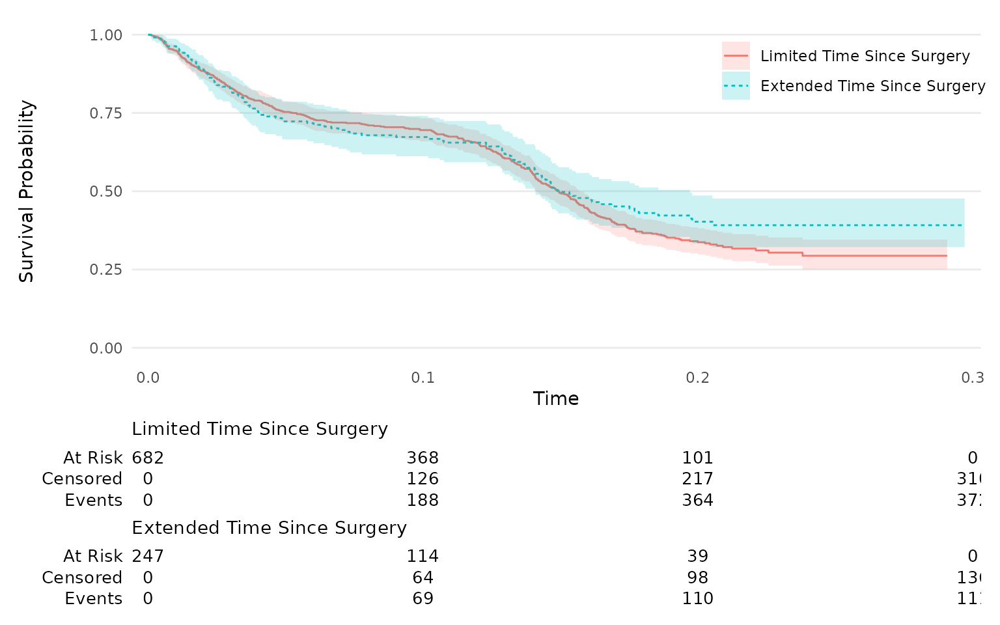
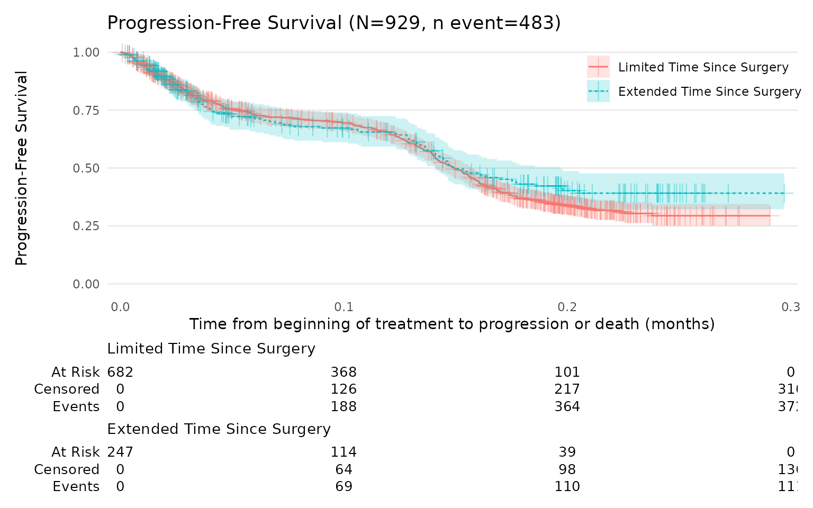
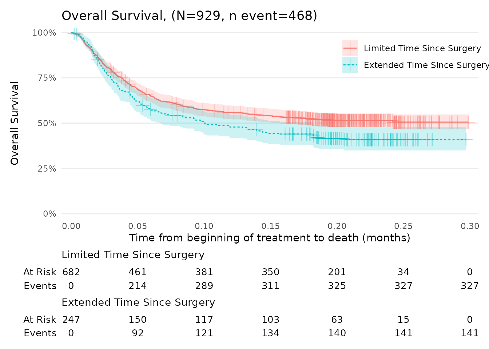

# Kaplan-Meier Guideline Suggestions

## Introduction

In this example, two key survival endpoints are analysed:

- Progression-Free Survival (PFS): Defined as the time from treatment
  initiation to either disease progression or death.

- Overall Survival (OS): Defined as the time from treatment initiation
  to death from any cause.

This vignette covers the following steps:

- Preparation of the dataset.

- Creation of time-to-event and event indicator variables.

- Compute Kaplan-meier estimator and fitting of Kaplan-Meier curves

- Visualization of survival curves accompanied by risk tables.

The approach presented here follows the recommendations provided by
Daniel Sjoberg’s `ggsurvfit` package for generating publication-ready
Kaplan-Meier plots.

First, install packages if needed and load them.

``` r
## Load libraries

library(grstat)
library(dplyr)
library(survival)
library(ggsurvfit)
library(glue)
```

### Data Overview

The dataset used is an extension of the dataset provided by the
`ggsurvfit` package. Additional variables were simulated to resemble to
a typical dataset from an oncology clinical study, including information
on progression status, survival times, and treatment characteristics.
**Note:** In this example, the end date is determined using the
[`pmax()`](https://rdrr.io/r/base/Extremes.html) function, which selects
the latest available date from the following: date of death, last visit,
last RECIST scan, last patient contact, end of treatment, or last
follow-up.

``` r
## Display dataset

head(data_surv)
#> # A tibble: 6 × 6
#>      id death date_start date_progression date_end   surg                       
#>   <dbl> <dbl> <date>     <date>           <date>     <fct>                      
#> 1     1     1 2021-04-16 2021-04-18       2021-04-19 Limited Time Since Surgery 
#> 2     2     0 2021-05-20 2021-05-25       2021-05-28 Limited Time Since Surgery 
#> 3     3     1 2021-03-27 NA               2021-03-28 Limited Time Since Surgery 
#> 4     4     1 2021-05-14 NA               2021-05-15 Extended Time Since Surgery
#> 5     5     1 2021-05-27 NA               2021-05-28 Extended Time Since Surgery
#> 6     6     1 2021-06-06 NA               2021-06-09 Limited Time Since Surgery

dim(data_surv)
#> [1] 929   6
```

## Data Preparation

### Variable Creation

The purpose of this section is to create status and time variables for
Progression-Free Survival (PFS) and Overall Survival (OS).

First, the variables time and status (indicating whether an event
occurred or was censored) need to be created to enable the use of
various functions.

- Time variable: The time variable represents the duration from a
  defined starting point (e.g., diagnosis, study enrollment, or start of
  treatment) to the time at which the patient’s status is recorded
  (e.g. death, disease progression, recurrence or last news). It is a
  numeric variable measured in units such as days, months, or years,
  depending on the study’s duration and requirements.

- Status variable: The status variable is binary, indicating whether the
  event has occurred (event = 1) or not (censored = 0) for each subject
  by the end of the study period.

An event (1) indicates that the subject experienced the event of
interest (e.g., death, relapse, transplant failure, etc.).

Censored (0) refers to those subjects who did not experience the event
during the study. For these individuals, the ‘time-to-event’ is
considered censored, indicating that we only know they did not
experience the event up to a certain point.

``` r
## Example

data_surv_v2 = data_surv %>%
  mutate(
    status_PFS = ifelse(!is.na(date_progression), 1, 0 ),
    date_status_pfs = pmin(date_progression,date_end, na.rm = TRUE),
    status_OS = death,
    date_status_OS = date_end,
    time_pfs = as.numeric(date_status_pfs-date_start)/30.5,
    time_OS = as.numeric(date_status_OS-date_start)/30.5
  ) %>% 
  select(id,time_pfs,time_OS,status_PFS,status_OS,surg)

head(data_surv_v2)
#> # A tibble: 6 × 6
#>      id time_pfs time_OS status_PFS status_OS surg                       
#>   <dbl>    <dbl>   <dbl>      <dbl>     <dbl> <fct>                      
#> 1     1   0.0611  0.0869          1         1 Limited Time Since Surgery 
#> 2     2   0.175   0.277           1         0 Limited Time Since Surgery 
#> 3     3   0.0487  0.0487          0         1 Limited Time Since Surgery 
#> 4     4   0.0220  0.0220          0         1 Extended Time Since Surgery
#> 5     5   0.0469  0.0469          0         1 Extended Time Since Surgery
#> 6     6   0.0811  0.0811          0         1 Limited Time Since Surgery
```

## Kaplan-Meier Analysis

### Generate survival estimates using `survfit2()`

We recommend using the `ggsurvfit` package which uses
[`survfit2()`](http://www.danieldsjoberg.com/ggsurvfit/reference/survfit2.md)with
the following syntax:

``` r
km.model_PFS = survfit2(Surv(time_pfs, status_PFS) ~ surg, data = data_surv_v2)
km.model_PFS
#> Call: survfit(formula = Surv(time_pfs, status_PFS) ~ surg, data = data_surv_v2)
#> 
#>                                    n events median 0.95LCL 0.95UCL
#> surg=Limited Time Since Surgery  682    372  0.149   0.141   0.157
#> surg=Extended Time Since Surgery 247    111  0.149   0.141   0.197

# Specific time points can be chosen to extract the estimated survival probabilities and related statistics from the Kaplan-Meier survival model (km.model_PFS). Here, the time points were set at 0.05, 0.10, and 0.20.

tidy_survfit(km.model_PFS, times = c(0.05, 0.10, 0.20)) %>% 
  select(strata, time, n.risk, n.event, estimate, conf.high, conf.low)
#> # A tibble: 6 × 7
#>   strata                       time n.risk n.event estimate conf.high conf.low
#>   <fct>                       <dbl>  <dbl>   <dbl>    <dbl>     <dbl>    <dbl>
#> 1 Extended Time Since Surgery  0.05    136      60    0.723     0.786    0.665
#> 2 Extended Time Since Surgery  0.1     114       9    0.673     0.741    0.612
#> 3 Extended Time Since Surgery  0.2      39      41    0.403     0.486    0.333
#> 4 Limited Time Since Surgery   0.05    429     156    0.753     0.788    0.720
#> 5 Limited Time Since Surgery   0.1     368      32    0.695     0.733    0.659
#> 6 Limited Time Since Surgery   0.2     101     176    0.337     0.382    0.298
```

### Generate survival curves

For full documentation on `ggsurvfit`, visit the [ggsurvfit
website](https://www.danieldsjoberg.com/ggsurvfit/articles/gallery.html#kmunicate).

To cite their work, refer to the following:

> Sjoberg D, Baillie M, Fruechtenicht C, Haesendonckx S, Treis T (2025).
> *ggsurvfit: Flexible Time-to-Event Figures.*  
> R package version 1.1.0. Available at:
> <https://www.danieldsjoberg.com/ggsurvfit/>.

#### Progression-Free Survival (PFS)

``` r
km_PFS = survfit2(Surv(time_pfs, status_PFS) ~ surg, data = data_surv_v2) %>%
  ggsurvfit(linetype_aes = TRUE) +
  add_confidence_interval() +
  add_risktable(
    risktable_stats = c("n.risk", "cum.censor", "cum.event" )
  ) +
  theme_ggsurvfit_KMunicate() +
  scale_y_continuous(limits = c(0, 1)) +
  scale_x_continuous(expand = c(0.02, 0)) +
  theme(legend.position="inside", legend.position.inside = c(0.85, 0.85))
km_PFS
```



``` r

N_total <- nrow(data_surv_v2)
n_event <- sum(data_surv_v2$status_PFS == 1)
title_text <- glue("Progression-Free Survival (N={N_total}, n event={n_event})")
```

**This plot can be further customised, for example:**

``` r
km_PFS +
  add_censor_mark(size = 4, alpha = 0.4) +
  labs(
    x = "Time from beginning of treatment to progression or death (months)",
    y = "Progression-Free Survival",
    title = title_text
  ) 
```



#### Overall Survival (OS)

The function
[`scale_ggsurvfit()`](http://www.danieldsjoberg.com/ggsurvfit/reference/scale_ggsurvfit.md)
can be used to automatically adjust the axes limits of Kaplan-Meier
plots to better fit the data and improve visualisation. **Note:** The
[`scale_ggsurvfit()`](http://www.danieldsjoberg.com/ggsurvfit/reference/scale_ggsurvfit.md)
function automatically scales the y-axis in percentage.

``` r
km_OS = survfit2(Surv(time_OS, status_OS) ~ surg, data = data_surv_v2) %>%
  ggsurvfit(linetype_aes = TRUE) +
  add_confidence_interval() +
  add_risktable(
    risktable_stats = c("n.risk", "cum.event" )
  ) +
  theme_ggsurvfit_KMunicate() +
  scale_ggsurvfit()+
  theme(legend.position = "inside", legend.position.inside = c(0.85, 0.85))

N_total <- nrow(data_surv_v2)
n_event <- sum(data_surv_v2$status_OS == 1)
title_text <- glue("Overall Survival, (N={N_total}, n event={n_event})")


km_OS +
  add_censor_mark(size = 4, alpha = 0.4) +
  labs(
    x = "Time from beginning of treatment to death (months)",
    y = "Overall Survival",
    title =title_text 
  ) 
```


