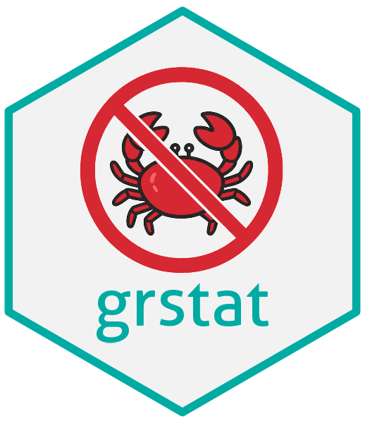

# grstat [](https://Oncostat.github.io/grstat/)

[grstat](https://oncostat.github.io/grstat/) is a package designed to
help standardize the descriptive clinical research analyses at GR.

## Installation

The package is not on CRAN, so you should install from GitHub:

``` r
# Install development version on Github
pak::pak("Oncostat/grstat@v0.1.0.9021")
```

Note that, for reproducibility purpose, an even better solution would be
to use [`renv`](https://rstudio.github.io/renv/articles/renv.html).

## Features

See the full documentation on <https://oncostat.github.io/grstat/>.

### Stable

- [`ae_table_grade()`](https://oncostat.github.io/grstat/reference/ae_table_grade.md),
  [`ae_table_soc()`](https://oncostat.github.io/grstat/reference/ae_table_soc.md)
- [`ae_plot_grade()`](https://oncostat.github.io/grstat/reference/ae_plot_grade.md),
  [`butterfly_plot()`](https://oncostat.github.io/grstat/reference/butterfly_plot.md)

### Dev

- [`gr_new_project()`](https://oncostat.github.io/grstat/reference/gr_new_project.md)
- [`waterfall_plot()`](https://oncostat.github.io/grstat/reference/waterfall_plot.md)
